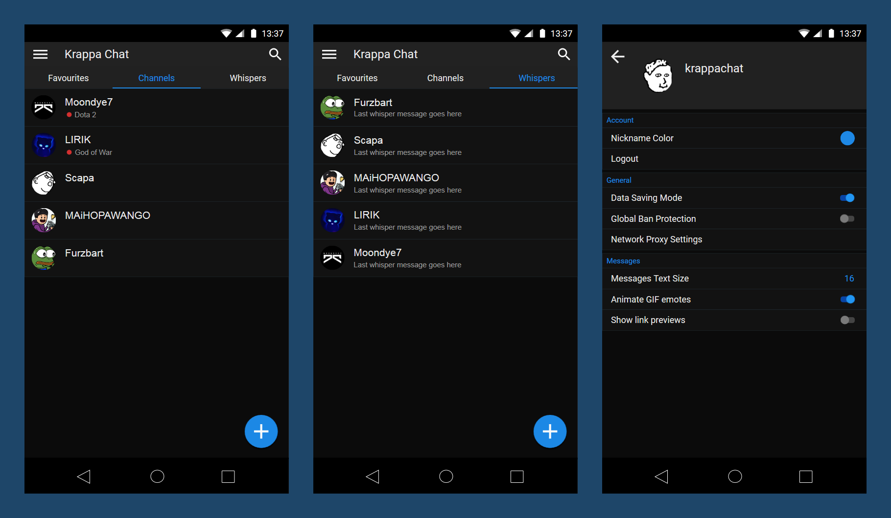

# KrappaChat
[](https://travis-ci.org/Chronophylos/KrappaChat) [](https://ci.appveyor.com/project/Chronophylos/krappachat) [](https://coveralls.io/github/Chronophylos/KrappaChat?branch=master) [](https://requires.io/github/Chronophylos/KrappaChat/requirements/?branch=master) [](https://codeclimate.com/github/Chronophylos/KrappaChat/maintainability) [](https://scan.coverity.com/projects/chronophylos-krappachat)

## Description

Current [mockup](https://app.moqups.com/novalis/5edP1cP1Yz/view)



***TODO FIX***
## Requirements
* [Python 3.6+](https://python.org)
* [Pipenv](https://pipenv.org)
* [SDL2](https://libsdl.org/download-2.0.php)
* [Gstreamer 1.x](https://gstreamer.net)
* [PyEnchant](https://pythonhosted.org/pyenchant)

You can get all additional requirements with
```bash
pipenv install
```

## Credits
Thanks to [Kenneth Reitz](https://kennethreitz.org) for his amazing Python projects.
